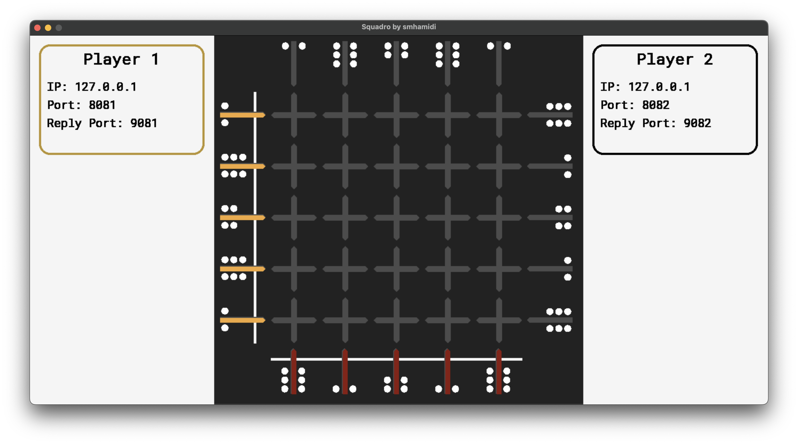

# 🎲 Squadro Game GUI



Welcome!  
This graphical interface provides a visual platform for the Squadro board game, allowing you to focus on implementing the core game logic.

---

## ✨ Features

-   **Visual Squadro game board**
-   **Real-time display of pawn movements**
-   **Information boxes** for each player, showing configured IP and ports
-   **Turn indication**
-   **Networked gameplay:** GUI acts as a central server/relay

---

## ⚙️ Installation & Setup

### 1. Clone the Repository

```bash
git clone https://github.com/smhamidi/Squadro_GUI_PyGame.git
cd Squadro_GUI_PyGame
```

### 2. Install Dependencies

> **Tip:** It’s highly recommended to use a virtual environment (e.g., conda).

```bash
conda create --name squador python
conda activate squadro
pip install -r Requirements.txt
```

---

## 🚀 Running the GUI

1. **Navigate to the project directory.**
2. **Run the main application:**

    ```bash
    python squadro.py
    ```

    The GUI window should appear, and the console will show messages indicating that the player servers (within the GUI) have started.

---

## 🧑‍💻 Implementing Your Player Agents

You need to create **two separate player programs**.  
Each player program will be an independent script that communicates with the GUI.

---

### 🔑 Key Configuration in `squadro.py` (GUI Code)

Before your player agents can connect, you **MUST** configure their network details within the `squadro.py` file (the GUI's main code).  
Find these lines and modify them as needed:

```python
# --- 1st Player states
player1_ip = "127.0.0.1"         # IP address OF PLAYER 1 (where GUI sends opponent's moves)
player1_port = 8081              # Port WHERE PLAYER 1 SENDS ITS MOVES (GUI listens here for P1)
player1_reply_port = 9081        # Port WHERE PLAYER 1 LISTENS for opponent's moves (GUI sends here to P1)

# --- 2nd Player states
player2_ip = "127.0.0.1"         # IP address OF PLAYER 2 (where GUI sends opponent's moves)
player2_port = 8082              # Port WHERE PLAYER 2 SENDS ITS MOVES (GUI listens here for P2)
player2_reply_port = 9082        # Port WHERE PLAYER 2 LISTENS for opponent's moves (GUI sends here to P2)
```

#### **Explanation of Configuration**

-   **`playerX_ip`:**

    -   The IP address of the machine where **your Player X program is running and listening for replies**.
    -   If your player program runs on the _same machine_ as the GUI, `127.0.0.1` (localhost) is usually correct.
    -   If Player X runs on a _different machine_, use Player X's machine's IP address on the network.

-   **`playerX_port`:**

    -   The port on the **GUI's machine** that the GUI will listen on for moves _from_ Player X.
    -   Your Player X program must send its moves to `GUI_IP:playerX_port`.

-   **`playerX_reply_port`:**
    -   The port on **Player X's machine** where your Player X program must listen for incoming messages (i.e., the opponent's last move) sent _by the GUI_.
    -   The GUI will send data to `playerX_ip:playerX_reply_port`.

---

### 🌐 Network Communication Flow

#### 1. **GUI Starts**

-   The GUI (`squadro.py`) starts two HTTP servers:
    -   One listening for Player 1 on `GUI_IP:player1_port` (e.g., `127.0.0.1:8081` by default).
    -   One listening for Player 2 on `GUI_IP:player2_port` (e.g., `127.0.0.1:8082` by default).
-   The GUI waits for the current player to make a move.

#### 2. **Player Sends Move to GUI**

-   Assume it's Player 1's turn.
-   Your Player 1 program decides on a pawn to move (e.g., pawn number 3).
-   Player 1 sends an HTTP POST request to the GUI:
    -   **URL:** `http://<GUI_IP>:<player1_port>` (e.g., `http://127.0.0.1:8081`)
    -   **Method:** `POST`
    -   **Body (JSON):** `{"move": <pawn_number>}` (e.g., `{"move": 3}`)
    -   **Headers:** `Content-Type: application/json`

#### 3. **GUI Processes Move & Responds to Active Player**

-   The GUI receives the POST request on `player1_port`.
-   It processes the move using `process_move()`.
-   It sends a response back to Player 1:
    -   `{"status": true}` if the move is valid and processed.
    -   `{"status": false}` or an error if the move is invalid.

#### 4. **GUI Relays Move to Opponent Player**

-   If the move was valid, the GUI then sends the _same move information_ to the other player (Player 2) so they know what Player 1 did.
-   The GUI makes an HTTP POST request to Player 2's listening endpoint:
    -   **URL:** `http://<player2_ip>:<player2_reply_port>` (e.g., `http://127.0.0.1:9082`)
    -   **Method:** `POST`
    -   **Body (JSON):** `{"player": 1, "move": <pawn_number>}` (e.g., `{"player": 1, "move": 3}`)
    -   **Headers:** `Content-Type: application/json`
-   Your Player 2 program must have an HTTP server listening on `player2_ip:player2_reply_port` to receive this.

#### 5. **Turn Switches**

-   The GUI internally switches the `current_player` to Player 2.
-   The cycle repeats with Player 2 sending its move to `http://<GUI_IP>:<player2_port>`.

---

## 🕹️ Game Rules (룰)

### In Few Words

-   **Setup:** Both players start with their pieces in troughs on their side of the game board, sitting perpendicular to one another.
-   **Movement:** When you move a piece, it advances a number of cells equal to the strength indicated in the trough it leaves.
-   **Return:** Once a piece reaches the far side, it turns around and moves back based on the strength on the other side.
-   **Passing Over:** If you pass over an opposing piece, that piece returns to its last departing base, and your piece advances one cell further than where the opposing piece was.
-   **Winning:** The first player to make a return trip with all pieces but one wins.

### In Detail

1. **Movement Direction:**  
   Pieces only move vertically (in their own column).

2. **Movement Distance:**  
   Pieces advance as many cells as the value under their starting cell indicates.

3. **Turning Around:**  
   When a piece reaches its last row, it turns around. The new value for the piece to advance is the one written under the new starting cell.

4. **Encountering Opponent's Piece:**

    - If a player moves and there is an opponent's piece in the way:
        - The moving piece advances to one cell further than where the opponent's piece was.
        - The opponent's piece returns to its last starting cell.
        - If there is another opponent's piece in the new cell, repeat this step.

5. **Finishing:**  
   When a piece returns to the row where it started the game, it ends its game and is removed from the board.

6. **Winning the Game:**  
   When all pieces but one finish their race, the player in turn wins the game. The game is over.

---

## 👤 Credits

-   **GUI Creator:** [Hamidi](https://github.com/smhamidi)
-   **Game Creator:** [adrian jimenez pascual](https://github.com/dirdam)

---
